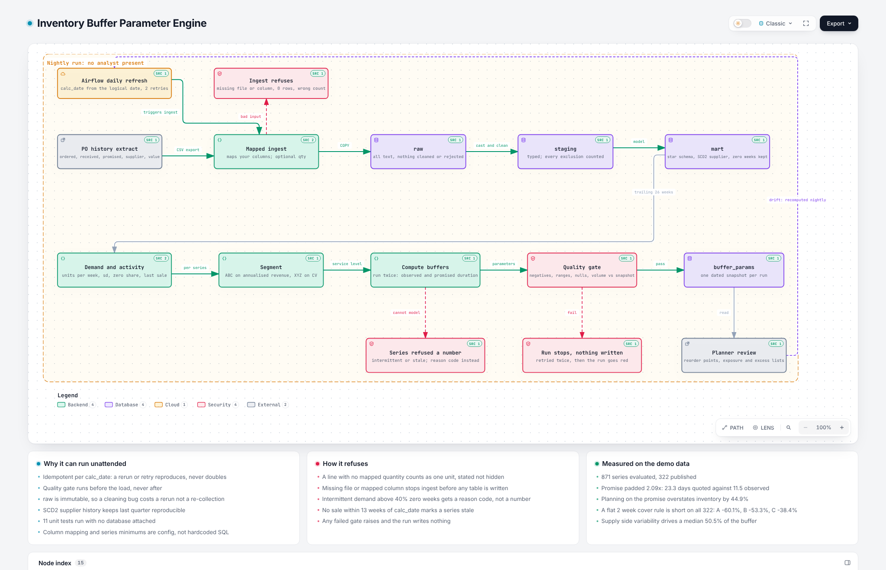

# Inventory Buffer Parameter Engine

**An automated version of a consulting engagement I delivered by hand.
It recomputes inventory buffer parameters from observed transaction data
instead of from quoted values held in master data, and refreshes them on a
schedule so they cannot go stale.**

---

## Why I built this

At EY I rebuilt the inventory buffer policy for a multi-brand FMCG conglomerate
running ten regional distribution centres in India. The client was using a flat
25-day cover rule across the board. I replaced it with a two-variable
statistical model across 150 location and SKU pairs, on an Alteryx and Python
pipeline over SAP extracts.

Two things came out of it. The model **sized excess working capital at a fixed
98% service level**, and roughly **95% of the required buffer traced to supplier
lead time variance rather than demand variability**. The client approved the
business case and piloted it the following quarter. That figure was opportunity
sized and validated against the client's own data, not realised savings, and I
describe it that way deliberately.

**But it was a one-time study, and that is the problem this repository exists
to solve.**

The engagement produced a set of numbers that were correct on the day they were
delivered. Suppliers change, volumes change, and demand variability drifts.
Within a few quarters those parameters are wrong again, and the client's only
options are to live with it or commission another study. Every company running
a flat cover rule has the same problem, and most of them will never hire a
consultant to look at it.

So the fix is not a better analysis. It is **turning the analysis into a system
that runs itself**: ingests the transaction data, recomputes the parameters,
checks its own output, and publishes a dated snapshot, every night, without
anyone opening a spreadsheet. That is what is in this repository.

The EY work is under NDA, so this is the method rebuilt on public data where
every line is inspectable and the whole thing runs with one command. The dataset
is different and the proxy is imperfect, which is stated below rather than
buried.

## Goal

Take a problem that is normally solved once, by hand, in a consulting
engagement, and make it a pipeline any company with transaction history can run
continuously: recompute buffer parameters correctly across a catalogue, on a
schedule, without silent failure.

## Outcomes

Three, each measurable and each verifiable by running the code.

1. **A pipeline that can be trusted to run unattended**, which is the whole
   point: a one-time study needs an analyst, a system does not. Idempotent
   loads, layered architecture, in-pipeline quality gates that fail the run
   before bad numbers reach a planner, eight unit tests that need no database,
   and an Airflow DAG whose four tasks have been executed to success.
2. **A quantified demonstration that promised and observed durations diverge
   enough to change the answer.** Promised duration is padded 2.09x against
   observed, and planning on the promise overstates total inventory by 44.9%.
3. **A quantified demonstration that a flat buffer rule is short everywhere and
   worst where it matters most.** A two-weeks-of-cover policy is below the
   model target on all 322 published series, by 60% on A-class against 38% on
   C-class.

---

## The proxy, stated up front

The public dataset is Olist, a Brazilian e-commerce marketplace: 99,441 orders,
112,650 order lines, 3,095 sellers, 2016 to 2018.

**Olist is a marketplace, not a distribution network.** It has no warehouse, no
replenishment cycle and no inventory position table. That has one consequence
that matters more than any other, and it is the first thing I raise rather than
wait to be asked:

> The duration measured here is **outbound fulfilment time** (order placed to
> customer delivered). A replenishment buffer formula expects **inbound
> replenishment lead time** (purchase order placed to goods received). These are
> different quantities in different directions.

The EY work used the correct input; this repository uses a proxy. What transfers
is the method, the pipeline and the engineering. The columns are named
`observed_fulfil_*` and `promised_fulfil_*` rather than `lead_time_*` throughout
the code, so the substitution cannot be forgotten downstream.

Three further limitations:

- No on-hand inventory, so this recommends parameters rather than validating
  them. Backtesting would need inventory position history.
- The formula assumes demand and lead time are independent. In practice a demand
  surge strains the same supplier, so durations stretch exactly when demand is
  highest, which understates risk in the worst case.
- 58% of series have intermittent demand and are flagged rather than given a
  number that would look authoritative and be wrong.
- Roughly 13% of each series' demand standard deviation comes from its single
  largest week. Buffers are therefore sensitive to one-off spikes, and a
  production deployment would want outlier handling or a seasonal decomposition
  before the numbers drive purchase orders.
- Parameters are stamped `calc_date = 2018-08-31`, the dataset's last delivered
  order week. Series with no sale within 13 weeks of that date are marked stale
  and not published.

---

## Architecture



<sub>Interactive version with a theme toggle and SVG export:
[`docs/architecture-interactive.html`](docs/architecture-interactive.html).
Every box carries the file and line range that proves it.</sub>

Four things in that picture are the difference between a system and a one-time
study: the orchestrator across the top that runs it without anyone present, the
quality gate that halts the run instead of publishing a bad number, the dated
snapshot that turns the output into a history rather than a replacement, and the
loop at the bottom that exists because supplier behaviour and demand keep moving.

**raw** is the audit trail. Every column is `text` so `COPY` cannot reject a
malformed row and hide it. The source's `product_name_lenght` misspelling is
preserved, because raw must mirror the file. Row counts are verified against the
dataset's published figures on every load, so a truncated or swapped mirror
fails loudly.

**staging** is where judgment lives. Each exclusion is written to
`staging.exclusions` with a row count, so any number can be reconstructed later.

**mart** is modelled for the question. `dim_seller` is SCD Type 2, so a seller
whose profile changed in January does not silently rewrite December's numbers.

**`buffer_params` is keyed on `calc_date`**, which is what makes this a system
rather than a report. Every run writes a dated snapshot, so the table becomes a
history of how each parameter moved as suppliers and demand changed. That is
the thing a one-time study can never give you: when a planner asks why the
number is different from last quarter, the answer is a query rather than a
guess.

**Grain: one row is one category, one seller, one week.** Forced by the data,
not chosen. The median product sold once in 21 months and 18,117 of 32,951
products sold exactly once, so per-product statistics are not computable.

---

## Data quality decisions

Every exclusion counted, none silent. 96,184 of 99,441 orders survive.

| Decision | Rows | Why |
|---|---|---|
| Keep `order_status = 'delivered'` only | 2,963 | No observable duration otherwise. Keeping them would bias reliability upward, since the worst performers never arrived. |
| Drop delivered orders with a null delivery timestamp | 8 | Internally contradictory. |
| Drop deliveries preceding dispatch | 23 | Negative durations corrupt a series' standard deviation, because squaring amplifies them. |
| Trim to 2017-01-01 onward | 267 | Sep–Dec 2016 holds 329 orders and November 2016 is absent entirely. Platform launch, not demand. |
| Bucket 610 null categories as `unknown` | 0 | Dropping would silently remove their demand from totals. |
| Keep zero-demand weeks | n/a | Dropping understates variability and under-buffers. The calendar spine is generated, then demand joined on. |

---

## The method

```
SS  = Z × sqrt( LT × σ_D²  +  D̄² × σ_LT² )
ROP = D̄ × LT + SS
```

Computed twice per series, once on observed statistics and once on promised,
which is what produces Outcome 2. Service level is assigned by ABC class
(A 98%, B 95%, C 90%) rather than applied flat.

Mean duration drives cycle stock linearly. Duration *variability* drives safety
stock, and only through a square root. Conflating them is why "we halved lead
time so inventory should halve" is wrong.

---

## Results

**Promised vs observed**, across all 322 published series without exception:

| | Promised | Observed |
|---|---|---|
| Mean | 23.3 days | 11.5 days |
| Std dev | 7.82 days | 8.02 days |

Padded 2.09x. The standard deviations are close, so the promise is not a flat
rule; it varies by route. The divergence is in the mean.

**Inventory position implied by each:**

| | Cycle stock | Safety stock | Total |
|---|---|---|---|
| On promised duration | 3,560 | 3,834 | **7,394 units** |
| On observed duration | 1,815 | 3,288 | **5,103 units** |

44.9% overstated, and most of the gap is cycle stock rather than safety stock,
for the square-root reason above.

**A flat cover rule, compared like for like.** A planner saying "we hold two
weeks of cover" means total on-hand, so the comparison is against the model's
total target (cycle plus safety), not against safety stock alone:

| Class | Series | Naive 2-week total | Model total target | Gap | Short on |
|---|---|---|---|---|---|
| A | 197 | 1,688 | 4,234 | **-60.1%** | 197 of 197 |
| B | 98 | 350 | 750 | -53.3% | 98 of 98 |
| C | 27 | 74 | 120 | -38.4% | 27 of 27 |

Short on every published series, and the shortfall widens as the class matters
more. The flat rule is indexed to average demand and blind to variability, and
the A-class population is overwhelmingly Y or Z on the variability axis.

**Variance decomposition.** Supply-side variability accounts for a median 50.5%
of the required buffer, ranging 12.8% to 86.1%, and is the majority driver for
168 of 322 series. At EY the equivalent figure was ~95% on genuine replenishment
lead times. These are not comparable and this is not presented as a
reproduction: the structural point is the same, the magnitudes are not.

**Population.** Of 871 series evaluated, 322 are published. 441 are held back as
intermittent, 39 as stale, and 69 as both. Held-back series carry a reason code
instead of a number.

A review dashboard covering all of this is in `dashboard/index.html`.

---

## Running it on your own data

The pipeline is not tied to the demo dataset. It needs a purchase order history
with five facts: when each order was placed, when it was received, when it was
promised, what was ordered from whom, and what the line was worth. Describe your
column names once in `mapping.yaml`, run `python scripts/check_input.py` to
validate before loading, and the rest is unchanged. No SQL to edit.

This is tested, not asserted: the repository runs against a synthetic SAP-style
extract with entirely different column names, file names and status values, and
produces the same parameters as the demo data it was derived from.

**[USAGE.md](USAGE.md) is the guide** — the five facts, the mapping file, the
business settings in `config.yaml`, what the output columns mean, and what to
check before acting on the numbers.

## Running the demo

```bash
docker compose up -d
kaggle datasets download -d olistbr/brazilian-ecommerce -p data/raw --unzip
pip install -r requirements.txt
cp .env.example .env
make all                       # up, ddl, ingest, profile, marts, run, test, findings
make dashboard
```

To run it under Airflow instead:

```bash
make airflow                   # http://localhost:8080, admin / admin
```

Inside the Airflow containers the database host is `ss-postgres` on port `5432`,
not `localhost`. Host port mapping only affects traffic from your machine.

---

## Tests

Eight unit tests, no database required, because transform functions take and
return DataFrames and never open a connection.

One caught a real bug: ABC classification on the *inclusive* cumulative revenue
share pushed the series crossing the 80% line down into B or C, and with a
single series classified the only item as C, applying the wrong Z. Fixed by
classifying on the exclusive cumulative share. The fix is commented at the site
and `test_abc_uses_exclusive_cumulative_share` guards it.

---

## What I would do differently at scale

- Partition the demand fact by year and process incrementally rather than
  recomputing the full window.
- Move staging and mart transformations into dbt so the layer graph and its
  tests are declarative.
- Alert on quality-gate failures rather than relying on someone reading run
  history.
- Implement Croston's method for the intermittent 58%.
- Source genuine replenishment lead times, which removes the proxy entirely.

## Two review passes before publication

The numbers here survived two reviews, read as a planner and as an analyst
rather than as a developer. The first caught six issues, including a
comparison error that changed a headline. The second caught four more:

- **Demand was counted in order lines, not units.** Correct for this dataset,
  which writes one row per unit, and wrong for any normal purchase order line.
  `quantity` is now a mapped column with an explicit one-unit fallback.
- **`min_weeks_history` was dead config.** The value was hardcoded in SQL while
  `config.yaml` advertised a knob that did nothing. Both series minimums now
  travel through the config table.
- **The architecture diagram showed Airflow triggering the compute step** when
  the DAG's first task is ingest.
- **`ss_baseline` duplicated `naive_total_cover`** in the published output.

Both passes are written up in [docs/defensibility.md](docs/defensibility.md),
with the pre-correction figures kept.

## Documentation

| File | What it is for |
|---|---|
| [USAGE.md](USAGE.md) | running it on your own extract |
| [docs/defensibility.md](docs/defensibility.md) | every design decision, the challenge against it, and the answer, including the six issues a pre-publication audit caught |
| `mapping.yaml` | the source-to-canonical column mapping |
| `config.yaml` | the business settings: service levels, windows, your current baseline policy |
